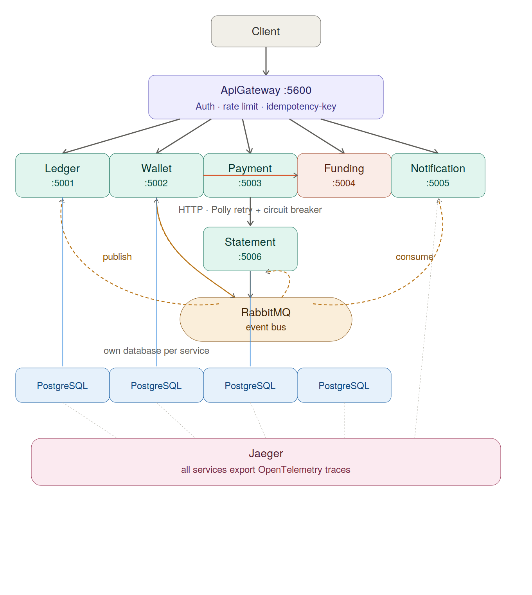

# PayFlow: Real-Time Payments & Ledger Platform

## What Is PayFlow?

An event-sourced, saga-orchestrated wallet and payments platform demonstrating production-grade fintech engineering patterns demonstrating idempotent APIs, double-entry ledger, outbox-based event publishing, CQRS, distributed tracing, and configurable resilience against a deliberately flaky funding source.

### Scope

| Feature               | Description                                        |
| --------------------- | -------------------------------------------------- |
| Wallet accounts       | Per-user, single currency (GBP)                    |
| Top-up                | Simulated external funding via fake card processor |
| Peer-to-peer transfer | Wallet to wallet                                   |
| Merchant payment      | Authorize (hold) then Capture or Release (saga)    |
| Transaction history   | CQRS read model / statement                        |

---

## Architecture



Infrastructure:

- **PostgreSQL** (:5432): one database per service. pgAdmin at :5050 (admin@payflow.dev / admin)
- **RabbitMQ** (:5672): message broker. Management UI at :15672 (guest / guest)
- **Jaeger** (:16686): distributed tracing via OTLP (:4317)

---

## Architecture Decisions

### 1: Feature-Folder Architecture over Strict Clean Architecture Layers

**Context:** Each service could be split into 4+ .csproj files (Domain, Application, Infrastructure, Api) to enforce dependency direction at the compiler level. That would result to as about 30 projects across 7 services.

**Options:**

1. **Strict Clean Architecture (4+ projects/service):** Compiler-enforced isolation via separate assemblies. approx. 30 projects total. Slower builds, more ceremony.
2. **Vertical Slices:** Feature-organized code with maximal cohesion. This can lead to infrastructure duplication.
3. **Feature-Folder Architecture (chosen):** One project per service with layering enforced by folder convention and automated architecture tests.

**Why:** Production fintech services rarely split into 4 assemblies because the cost in build time and navigation outweighs the benefit. A single project with feature folders achieves the same architectural boundaries when paired with automated tests, while keeping developer iteration fast. The layering is preserved in the _code_ (domain types don't reference EF), not in the _build system_.

**Tradeoff:** Requires discipline during code review. This can be managed or mitigated by architecture tests that fail CI if infrastructure leaks into domain.

---

### 2: Async Event-Driven Inter-Service Communication via Outbox

**Context:** WalletService orchestrates top-up and transfer operations that must record double-entry pairs in LedgerService. The outbox pattern is required for atomic DB and event publishing.

**Options:**

1. **Synchronous HTTP:** WalletService calls LedgerService REST API. Simple but couples service availability and skips the outbox pattern.
2. **MassTransit Request/Response:** Sends a command and awaits a reply via RabbitMQ. This doesn't leverage outbox pattern, adds timeout complexity.
3. **MassTransit Fire-and-Forget and Outbox (chosen):** Handler writes to an `outbox_messages` table in the same EF transaction as business data. A background `OutboxRelayService` publishes pending messages to RabbitMQ. LedgerService consumes the command and publishes a result event.

**Why:** This decision checks three deliverables at once: async communication, the outbox pattern, and eventual consistency. The `202 Accepted` and correlation ID pattern mirrors real fintech APIs. If LedgerService is down, the outbox holds messages until it recovers. Adding new consumers (StatementService, NotificationService) requires zero changes to the publisher.

**Tradeoff:** Clients receive `202 Accepted` and must poll for completion. Not suitable for synchronous low-latency flows. Adds infrastructure complexity (outbox table, background relay, eventual consistency guarantees).

---

### 3: Purely Event-Driven Fan-Out Notifications (No Database)

**Context:** NotificationService exists to demonstrate eventual consistency and fan-out from ledger events. It consumes `LedgerEntryCreatedEvent` and `LedgerEntryFailedEvent` and simulates email and push notifications.

**Options:**

1. **Store notifications in PostgreSQL:** EF Core and repository pattern matching other services. Adds migrations and connection pool overhead for a service whose only job is logging simulated notifications.
2. **Pure fan-out consumer (chosen):** No database. Consumers log structured messages. Notifications are observable via structured logs and OpenTelemetry traces.

**Why:** NotificationService is intentionally the simplest service which shows how event-driven architecture works (adding a new consumer requires zero changes to producers) without unnecessary infrastructure. The fan-out pattern is demonstrated by the fact that NotificationService subscribes to the same events as other consumers but operates independently. Real notification delivery would use SendGrid or Firebase, not a database.

**Tradeoff:** No persisted notification history. In production you would store notification status (sent, failed, retrying) in a database.

---

### 4: Single ApiGateway with Centralized Middleware Pipeline

**Context:** The system has 7 services, each needing authentication, rate limiting, and idempotency enforcement. These concerns could be handled per-service or centralized.

**Options:**

1. **Per-service middleware:** Each service independently implements API key auth, rate limiting, and idempotency checks. Duplicated code across 7 services, inconsistent behavior risk.
2. **ApiGateway as reverse proxy (chosen):** YARP Reverse Proxy routes `/api/{service}/*` to backend services. A single middleware pipeline (rate limiter, API key auth, idempotency-key check) runs before the proxy. Backend services are not exposed directly.

**Why:** Centralizing cross-cutting concerns eliminates duplication and ensures consistent enforcement. The gateway strips the service prefix before forwarding, so backend services are unaware of the routing layer and can be tested independently. The YARP config is driven by `appsettings.json` or env vars, making route changes a configuration operation not a code change.

**Tradeoff:** The gateway is a single point of entry and a potential bottleneck. In production,we might consider running multiple gateway instances behind a load balancer at scale. Latency is negligible because YARP adds approx. 1ms per request.

---

### 5: Application-Level Saga (No MassTransit State Machine)

**Context:** PaymentService implements a merchant payment flow: authorize (hold funds), capture (complete payment), or release (compensating transaction). This is a saga.

**Options:**

1. **MassTransit saga state machine:** Use `MassTransitStateMachine` with `ISaga` repository. Provides built-in persistence, retry, and timeout handling. Adds a new persistence store and a steeper learning curve.
2. **Application-level saga via outbox + consumers (chosen):** Payment state is modeled as a domain enum (`PaymentStatus`). API handlers write outbox messages to produce ledger commands. Event consumers advance the state.

**Why:** The saga has only 7 states and 4 transitions — not complex enough to justify a state machine framework. The outbox pattern already provides reliable message delivery. The application-level approach keeps the saga logic co-located with the domain code rather than in a separate saga definition file.

**Tradeoff:** No built-in timeout mechanism — a payment stuck in `Authorized` state would never auto-release. In production you would add a background job or use MassTransit's scheduled messages for timeout handling.

---

### 6: One Database Per Service (Database-Per-Service Pattern)

**Context:** The system has 6 PostgreSQL databases. Each data-owning service needs persistence.

**Options:**

1. **Single shared database:** One PostgreSQL database with schema-per-service isolation. Simpler Docker setup but no data isolation.
2. **One database per service (chosen):** Each service owns its schema and connection string. Services interact only through events or HTTP, never through shared database access.

**Why:** Database-per-service is the canonical microservice pattern. It enforces bounded context isolation at the data layer and the strongest form of service boundary. Each service can independently migrate its schema.

**Tradeoff:** More connection strings to manage (6 vs 1). Cross-service queries require API composition rather than a SQL join.

---

### 7: FundingService as In-Memory, Stateless Service

**Context:** FundingService simulates an external card processor with a configurable failure rate. It needs idempotency but has no persistent storage requirements.

**Options:**

1. **Full EF Core and PostgreSQL:** Database-backed idempotency store. Adds migrations and latency for a service whose sole purpose is simulated flakiness.
2. **In-memory idempotency store (chosen):** A `ConcurrentDictionary` backed by `IIdempotencyStore` interface. No database dependency. Failure rate is configurable via `FundingFailureRate` env var (default 0.3).

**Why:** FundingService exists to force resilience patterns in WalletService (Polly retry and circuit breaker). Adding a database would add operational weight without demonstrating a meaningful pattern. The `IIdempotencyStore` interface makes it trivial to swap to Redis or PostgreSQL for production.

**Tradeoff:** Idempotency cache is lost on service restart. In production you would use a shared cache (Redis) so the idempotency guarantee survives deployments.

---

### 8: CQRS Read Model via Same Event Stream

**Context:** StatementService provides a paginated transaction history for wallets. This is a read-side concern separate from the write-side ledger.

**Options:**

1. **Query the LedgerService API:** StatementService calls LedgerService's `/transactions` endpoint. Couples the read model to the write service's availability and schema.
2. **CQRS read model consuming events (chosen):** StatementService subscribes to `LedgerEntryCreatedEvent` on RabbitMQ. For each event, it writes two `StatementEntry` rows to its own database.

**Why:** The read model is tailored to the query it serves (pagination, filtering, sorted by time) rather than the normalized write model. Building the statement from the same event stream that drives the saga ensures consistency without coupling to LedgerService's API.

**Tradeoff:** Eventually consistent because there is a delay (typically less than 1 second) between a ledger entry being created and the statement appearing. The read model could drift if the consumer falls behind.

---

## Inter-Service Communication

### Event Flow (Async via Outbox and RabbitMQ)

The flow from a mutating request (top-up, transfer, authorize) to eventual consistency:

1. **Handler** writes a message to the `outbox_messages` table (same DB transaction as business data)
2. **OutboxRelayService** (runs every 5 seconds) queries unprocessed messages
3. It deserializes each message and publishes it to RabbitMQ
4. The message (`CreateLedgerEntryCommand`) is consumed by **LedgerService**
5. LedgerService creates a Debit and Credit ledger entry pair
6. **On success**, LedgerService publishes `LedgerEntryCreatedEvent` which fans out to:
   - **PaymentService**: advances the saga state
   - **StatementService**: writes 2 statement rows (CQRS read model)
   - **NotificationService**: simulated email and push notification
   - **WalletService**: logs the event
7. **On failure**, LedgerService publishes `LedgerEntryFailedEvent` which fans out to:
   - **PaymentService**: marks the payment as Failed (compensation)
   - **NotificationService**: simulated failure alert

### The Payment Saga

The saga has 7 states, implemented at the application layer (no MassTransit state machine):

- **PendingAuthorization** (initial state after POST /authorize)
- **Authorized** (hold placed on payer funds via HoldsAccount)
- **ProcessingCapture** (moving funds from holds to merchant)
- **Captured** (terminal success state)
- **ProcessingRelease** (returning holds to payer; compensating transaction)
- **Released** (terminal success state)
- **Failed** (terminal state, reached if ledger entry fails)

The `HoldsAccount` (GUID `00000000-0000-0000-0000-000000000001`) temporarily holds funds during authorization until capture or release.

### Idempotency

| Layer          | Mechanism                                                                           |
| -------------- | ----------------------------------------------------------------------------------- |
| ApiGateway     | Requires `Idempotency-Key` header on all POST/PUT/PATCH/DELETE (400 if missing)     |
| FundingService | In-memory `IdempotencyStore`: returns cached response on replay                     |
| Outbox         | Each outbox message is processed exactly once (marked ProcessedAtUtc after publish) |

### Resilience

- **FundingService**: configurable failure rate via `FundingFailureRate` env (default 0.3 / 30%)
- **WalletService to FundingService HTTP call**: Polly retry (3 attempts, exponential backoff) and circuit breaker (5 failures, 30s break)

---

## API Reference

All endpoints are accessed through the **ApiGateway** on port `5600`. Individual services are not meant to be called directly.

### Gateway Routes

| Route Prefix          | Backend             | Port |
| --------------------- | ------------------- | ---- |
| `/api/ledger/*`       | LedgerService       | 5001 |
| `/api/wallet/*`       | WalletService       | 5002 |
| `/api/payment/*`      | PaymentService      | 5003 |
| `/api/funding/*`      | FundingService      | 5004 |
| `/api/notification/*` | NotificationService | 5005 |
| `/api/statement/*`    | StatementService    | 5006 |

### LedgerService

| Method | Route                                    | Description                                    |
| ------ | ---------------------------------------- | ---------------------------------------------- |
| `POST` | `/api/ledger/entries`                    | Create a single ledger entry (debit or credit) |
| `POST` | `/api/ledger/transactions`               | Create a balanced double-entry pair            |
| `GET`  | `/api/ledger/accounts/{id}/balance`      | Get current balance                            |
| `GET`  | `/api/ledger/accounts/{id}/transactions` | Get transaction history                        |

### WalletService

| Method  | Route                               | Description                                      |
| ------- | ----------------------------------- | ------------------------------------------------ |
| `POST`  | `/api/wallet/wallets`               | Create a new wallet                              |
| `GET`   | `/api/wallet/wallets/{id}`          | Get wallet details                               |
| `PATCH` | `/api/wallet/wallets/{id}/status`   | Update wallet status (Active/Frozen/Closed)      |
| `POST`  | `/api/wallet/wallets/{id}/top-up`   | Initiate async top-up (requires Idempotency-Key) |
| `POST`  | `/api/wallet/wallets/{id}/transfer` | Initiate async transfer to another wallet        |

### PaymentService

| Method | Route                                | Description                             |
| ------ | ------------------------------------ | --------------------------------------- |
| `POST` | `/api/payment/payments/authorize`    | Authorize (hold funds)                  |
| `POST` | `/api/payment/payments/{id}/capture` | Capture authorized hold                 |
| `POST` | `/api/payment/payments/{id}/release` | Release hold (compensating transaction) |
| `GET`  | `/api/payment/payments/{id}`         | Get payment status                      |

### FundingService

| Method | Route                         | Description                                                         |
| ------ | ----------------------------- | ------------------------------------------------------------------- |
| `POST` | `/api/funding/funding/charge` | Simulate charging external source (requires Idempotency-Key header) |

### StatementService

| Method | Route                                                         | Description             |
| ------ | ------------------------------------------------------------- | ----------------------- |
| `GET`  | `/api/statement/api/statements/{walletId}?page=1&pageSize=20` | Get paginated statement |

### Health

Every service exposes `GET /health` (bypasses ApiGateway auth).

---

## Quick Start

```powershell
# Start full stack
cd docker
docker compose up -d

# Check everything is healthy
docker compose ps

# Tail logs for a service
docker compose logs -f wallet-service

# Stop everything
docker compose down -v   # -v deletes volumes (reset data)
```

### Default URLs and Credentials

| Service               | URL                             | Credentials                   |
| --------------------- | ------------------------------- | ----------------------------- |
| ApiGateway            | `http://localhost:5600`         | `X-Api-Key: payflow-demo-key` |
| Swagger (via gateway) | `http://localhost:5600/swagger` | (none)                        |
| pgAdmin               | `http://localhost:5050`         | `admin@payflow.dev` / `admin` |
| RabbitMQ Management   | `http://localhost:15672`        | `guest` / `guest`             |
| Jaeger UI             | `http://localhost:16686`        | (none)                        |

---

## Tests

236 tests

| Test Project              | Count |
| ------------------------- | ----- |
| LedgerService.Tests       | 64    |
| WalletService.Tests       | 65    |
| PaymentService.Tests      | 61    |
| FundingService.Tests      | 15    |
| StatementService.Tests    | 9     |
| NotificationService.Tests | 11    |
| ApiGateway.Tests          | 11    |

### Three Critical Tests

| Test                    | File                                         | What It Proves                                                     |
| ----------------------- | -------------------------------------------- | ------------------------------------------------------------------ |
| Idempotency double-fire | `tests/FundingService.Tests/HandlerTests.cs` | Same idempotency key causes handler to execute once                |
| Concurrent transfer     | `tests/WalletService.Tests/HandlerTests.cs`  | 5 parallel transfers between same wallets all succeed              |
| Saga compensation       | `tests/PaymentService.Tests/HandlerTests.cs` | Authorize then Release (compensating transaction) works end-to-end |

```powershell
dotnet test
```
